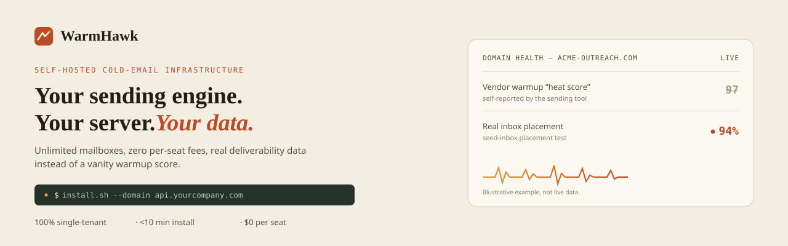

<a href="https://warmhawk.com">
  
</a>

<p align="center">
  <a href="https://github.com/warmhawk/warmhawk-core-engine/releases/latest"></a>
  <a href="https://github.com/warmhawk/warmhawk-core-engine/blob/main/LICENSE"></a>
</p>

<p align="center">
  <a href="https://warmhawk.com">warmhawk.com</a> ·
  <a href="https://warmhawk.com/docs">docs</a> ·
  <a href="https://warmhawk.com/compare/pricing">pricing</a> ·
  <a href="https://warmhawk.com/security">security</a> ·
  <a href="https://warmhawk.com/status">status</a>
</p>

---

> 🦅 Warm is the mechanic — mailbox warmup, deliverability-first sending. Hawk
> is precision targeting over volume. One server per account, not a shared
> pool: your own containers, your own database, your own TLS certificate.
> WarmHawk never touches your leads or mailbox credentials, because it never
> sees them.

### 🚀 Get running

The free engine takes one command and no license:

```bash
git clone https://github.com/warmhawk/warmhawk-core-engine.git && cd warmhawk-core-engine
./scripts/install.sh --domain api.yourcompany.com
```

Full sending/queueing API, direct access, no dashboard, no credit card. The
paid **Self-Hosted Pro** tier adds the operator dashboard on top — see
[What it costs](#what-it-costs) below.

---

### 🦅 Five reasons this isn't just another sending tool

1. **True infrastructure-level single tenancy.** Your own containers, database, nginx, TLS certificate, and Docker network. Not a "dedicated IP," not an isolated row in a shared database — nothing here is shared with any other customer, or with WarmHawk itself.
2. **Live in under 10 minutes, one command.** Handles TLS, secrets, and the full stack, start to finish.
3. **Real deliverability data, not a vanity score.** Most "warmup health" numbers are self-reported and can read 90+ while real inbox placement quietly collapses. WarmHawk surfaces an actual seed-inbox placement result instead.
4. **A queue engine that won't burn your domains.** Every send respects a minimum cadence floor with jitter; mailbox rotation is capacity-aware, favoring whichever mailbox has sent least recently.
5. **No per-seat, no credits, no hidden add-ons.** One flat fee per account. Warmup, uptime monitoring, and OTEL export are built in, not upsells.

---

### 💵 What it costs

Every tier runs the same sending engine — what changes is the dashboard, the support SLA, and how much of the running is done for you.

🆓 **Open Core — free.** Direct API access, no web UI. This repo.

⚡ **Self-Hosted Pro — $199/mo** (or $1,990/yr, two months free). Full operator dashboard, unlimited domains/mailboxes/users, live queue inspector, bundled Uptime Kuma + OTEL export, nightly backups, 2FA, a 1-business-day support SLA (4h on critical), and a 30-day money-back guarantee.

🏢 **Enterprise DFY — $999 one-time + $300/mo.** Everything in Pro, plus WarmHawk's founder handles deployment, DNS, and white-glove list migration for you.

Full breakdown: [warmhawk.com/compare/pricing](https://warmhawk.com/compare/pricing)

---

### 🥊 Built different

Instantly, Smartlead, Lemlist, and Woodpecker all run every customer on shared, vendor-owned servers. WarmHawk doesn't. Side-by-side write-ups:
[vs Smartlead](https://warmhawk.com/vs/smartlead) · [vs Lemlist](https://warmhawk.com/vs/lemlist) · [vs Woodpecker](https://warmhawk.com/vs/woodpecker) · [vs a custom n8n setup](https://warmhawk.com/vs/custom-n8n)

---

### 🗂️ Everything else

<table>
<tr><td valign="top" width="25%">

**Product**
- [Docs & quickstart](https://warmhawk.com/docs)
- [Domain health check](https://warmhawk.com/tools/domain-check)
- [Pricing](https://warmhawk.com/compare/pricing)
- [Status](https://warmhawk.com/status)

**For agents**
- [llms.txt](https://warmhawk.com/llms.txt) — curated index for AI crawlers
- [OpenAPI spec](https://warmhawk.com/openapi.json)

</td><td valign="top" width="25%">

**Repos**
- [warmhawk-core-engine](https://github.com/warmhawk/warmhawk-core-engine) — free, open-core (BSL 1.1)
- [warmhawk-enterprise-operator](https://github.com/warmhawk/warmhawk-enterprise-operator) — licensed dashboard, private

</td><td valign="top" width="25%">

**Community**
- [Roadmap (GitHub Discussions)](https://github.com/warmhawk/warmhawk-core-engine/discussions)
- [Security disclosure](https://warmhawk.com/security)

</td><td valign="top" width="25%">

**Contact**
- Support: support@warmhawk.com
- Security: security@warmhawk.com

</td></tr>
</table>

---

<p align="center">🦅 © 2026 WarmHawk. Self-hosted, always.</p>
